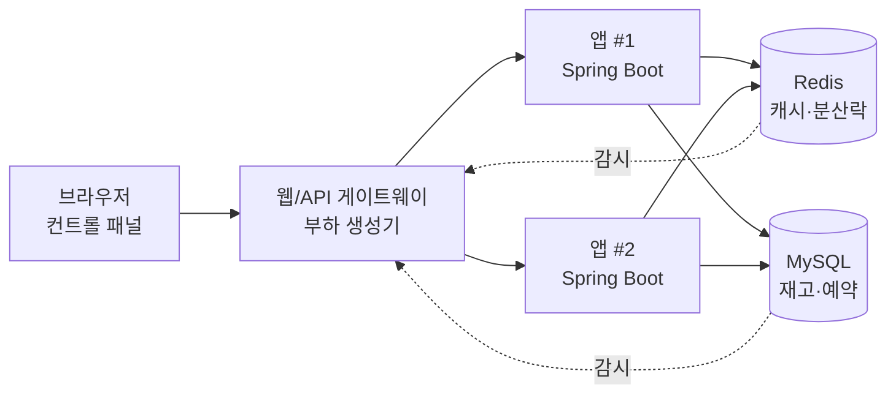

# 티켓팅 동시성 시뮬레이터 — 스펙 & 로드맵

2026-09-20 · @Someone

## 프로젝트 이름

**`concurrency-ticketing-lab`**&#32;

| 항목 | 값 |
| --- | --- |
| repo | `concurrency-ticketing-lab` |
| description | Toggle race conditions on and off in a ticket booking system — and watch consistency and throughput trade off |
| topics | `concurrency`, `race-condition`, `distributed-systems`, `spring-boot`, `mysql`, `redis` |

## 개요

이 프로젝트는 티켓 예매에서 발생하는 동시성 문제를 **토글로 켜고 끄면서 결과 차이를 숫자로 확인하는** 시뮬레이터입니다. 사용자는 좌석 수 N, 동시 사용자 수 M, 그리고 각 문제의 대응 전략을 선택해 실행하고, 정합성 지표와 성능 지표를 함께 받습니다.

핵심 주장은 하나입니다. **정합성을 지킬수록 처리량은 떨어진다.** 모든 방어를 켠 상태가 정답처럼 보이면 잘못 가르치는 것이므로, 두 축을 항상 같이 보여줍니다.

### 학습 목표

1. 애플리케이션 레벨 체크가 왜 동시성 방어가 될 수 없는지 체감
2. 인스턴스가 1대에서 2대로 늘어날 때 로컬 락이 무너지는 장면 관측
3. 동일한 정합성 결과를 내는 네 가지 전략의 처리량 차이 비교
4. 캐시 계층의 stale read가 "버그가 아니라 설계 선택"임을 구분

### 비목표

- 실제 예매 서비스 수준의 기능(결제, 회원, 좌석 배치도 UI)
- 부하 테스트 도구 대체 — 목적은 재현과 교육이지 성능 측정이 아님
- 브라우저 내 가상 시뮬레이션 — 실제 컨테이너에서 실제 락이 걸려야 함

## 시스템 아키텍처

앱 서버는 **반드시 2대 이상**입니다. 1대로 띄우면 JVM 내부 `synchronized`로 해결되는 문제만 나와서, "로컬 락이면 충분하다"는 잘못된 교훈을 주게 됩니다.



부하 생성기가 웹 계층에 함께 있는 이유는, M명의 동시 요청을 브라우저가 아니라 서버가 만들어야 지연 편차 없이 동시성이 확보되기 때문입니다. 브라우저는 파라미터 전송과 결과 구독만 담당합니다.

### 컨테이너 구성

| 컨테이너 | 역할 | 비고 |
| --- | --- | --- |
| `web` | 컨트롤 패널 서빙, 부하 생성, SSE로 실행 상태 스트리밍 | 시뮬레이션 오케스트레이터 |
| `app-1`, `app-2` | 예매 API. 동일 이미지, 동일 설정 | 앱 대수는 실행 파라미터로 1↔2 전환 |
| `redis` | 좌석 캐시, 분산 락, 멱등성 키 저장 | 2단계부터 본격 사용 |
| `mysql` | 재고, 좌석, 예약 원장 | `FOR UPDATE`·갭 락·데드락 관측용 |

### MySQL을 쓰는 이유

락 계층이 눈에 보여야 교보재가 됩니다. `SELECT ... FOR UPDATE` 대기, 갭 락, 데드락, 격리 수준 변경이 전부 관측 가능한 것은 MySQL입니다. MongoDB는 3단계 확장 주제로 붙여 WriteConflict 재시도 폭풍을 같은 UI에서 비교하는 편이 낫습니다.

## 시뮬레이션 파라미터

| 파라미터 | 범위 | 기본값 | 설명 |
| --- | --- | --- | --- |
| `seatCount` (N) | 1 \~ 1,000 | 100 | 좌석 수 |
| `userCount` (M) | 1 \~ 10,000 | 1,000 | 동시 요청 사용자 수 |
| `appInstances` | 1 또는 2 | 2 | 앱 서버 대수 |
| `seed` | 정수 | 랜덤 | 같은 시드 = 같은 결과. 결과 공유의 핵심 |
| `raceWindowMs` | 0 \~ 200 | 20 | read-modify-write 사이 지연 주입량 |
| `retryRate` | 0 \~ 50% | 0 | 중복 요청 비율 (2단계) |
| `seatPickStrategy` | `random` / `hotspot` | `hotspot` | 특정 좌석 집중 여부 |

### 지연 주입이 필수인 이유

그냥 돌리면 오버셀이 어떤 실행에서는 3건, 어떤 실행에서는 0건 나옵니다. 교육용으로는 실패입니다. 경합 창(window)을 인위적으로 벌려 재현율을 100%에 가깝게 만들어야 합니다.

```kotlin
@Service
class ReservationService(
    private val chaos: ChaosConfig,
) {
    fun reserve(eventId: Long, seatId: Long): ReserveResult {
        val remaining = repository.findRemaining(eventId)

        // 경합 창을 인위적으로 확대 — 시뮬레이터의 핵심
        chaos.injectDelay(Phase.AFTER_READ)

        if (remaining <= 0) return ReserveResult.SOLD_OUT
        repository.updateRemaining(eventId, remaining - 1)
        return ReserveResult.OK
    }
}
```

`raceWindowMs`를 0으로 두면 "운 좋으면 안 터지는" 현실을, 20으로 두면 "반드시 터지는" 교재를 각각 보여줄 수 있습니다. 이 슬라이더 자체가 좋은 학습 장치입니다.

### 동시성 모델

M개 요청을 동시에 쏘기 위해 가상 스레드(JDK 21+) 또는 코루틴을 사용하고, `CountDownLatch`로 출발선을 맞춥니다. 요청 간 출발 편차가 크면 경합 자체가 발생하지 않습니다.

```kotlin
val startGate = CountDownLatch(1)
val results = (1..userCount).map { userId ->
    scope.async {
        startGate.await()          // 전원 대기
        client.reserve(userId, pickSeat(userId))
    }
}
startGate.countDown()              // 동시 출발
```

## 대상 문제 카탈로그

선별 기준은 세 가지입니다. N·M을 키우면 **거의 확실히 재현**될 것, 결과가 **숫자 하나로 드러날** 것, 토글 on/off의 **대비가 명확**할 것. 선점 TTL 경합이나 커넥션 풀 고갈은 시간 축·부하 모델링이 추가로 필요해 1단계에서 제외합니다.

### 1단계 — 이 3개로 시작

| 문제 | 관여 계층 | 미해결 시 관측값 | 시작 순서 근거 |
| --- | --- | --- | --- |
| **오버셀 (Lost Update)** | 앱 ↔ DB | 판매 수 > N | 하네스 자체의 검증 장치. 이게 재현 안 되면 시뮬레이터가 동시성을 못 만들고 있다는 뜻 |
| **중복 배정 (Double Booking)** | DB | 한 좌석에 예약 2건 이상 | 총량은 맞는데 개별 좌석이 겹침 → "카운터만으로 부족한 이유" |
| **캐시 불일치 (Stale Read)** | 캐시 ↔ DB | 매진인데 "잔여 5석" 노출 | 캐시 계층의 존재 이유. 유일하게 "해결해도 완전히 안 사라지는" 문제 |

3개면 토글 조합이 8가지인데, 8가지가 전부 다른 결과를 냅니다. 조합 폭발 없이 의미 있는 탐색 공간이 나오는 지점입니다.

### 오버셀 대응은 체크박스가 아니라 라디오

대응책이 하나가 아니라 넷이고, **정합성은 넷 다 동일한데 처리량이 극적으로 다릅니다.** 체크박스로 만들면 이 차이가 드러나지 않습니다.

| 전략 | 구현 | 예상 정합성 | 예상 처리량 | 관측 포인트 |
| --- | --- | --- | --- | --- |
| `NONE` | read-modify-write | 오버셀 다발 | 최고 | 기준선 |
| `LOCAL_LOCK` | `synchronized` | 앱 1대는 정상, 2대는 실패 | 높음 | **앱 대수 토글과 연동되는 핵심 장면** |
| `CONDITIONAL_UPDATE` | `WHERE remaining > 0` | 정상 | 높음 | 가장 싸고 확실 |
| `PESSIMISTIC` | `SELECT FOR UPDATE` | 정상 | 낮음 | M=5,000에서 락 타임아웃 발생 |
| `OPTIMISTIC` | `@Version` + 재시도 | 정상 | 중간 | 재시도율 폭증 관측 |

```kotlin
// CONDITIONAL_UPDATE — 반환값 0이면 매진
@Modifying
@Query("UPDATE event SET remaining = remaining - 1 WHERE id = :id AND remaining > 0")
fun decrease(@Param("id") id: Long): Int
```

### 중복 배정 대응

| 전략 | 구현 | 결과 |
| --- | --- | --- |
| `NONE` | 애플리케이션 레벨 조회 후 INSERT | 중복 배정 발생 |
| `UNIQUE_CONSTRAINT` | `(event_id, seat_id)` 유니크 인덱스 | 정상. `DuplicateKeyException` 카운트 노출 |

유니크 제약은 **위의 모든 로직이 실패해도 마지막에 막아주는 유일한 계층**이라는 점을 UI에서 명시적으로 강조합니다.

### 캐시 불일치 대응

| 전략 | 구현 | 결과 |
| --- | --- | --- |
| `NONE` | 캐시만 읽고 TTL 만료까지 방치 | stale 노출 지속 |
| `TTL_SHORT` | 잔여석 TTL 1초 | stale 창 축소, 완전 제거는 아님 |
| `INVALIDATE_ON_WRITE` | 쓰기 후 캐시 삭제 | 대부분 해소. 삭제-재적재 경합은 잔존 |
| `REDIS_AS_SOT` | Redis를 소스 오브 트루스로, DB는 비동기 | 정상. 단 Redis 장애 시 시나리오 필요 |

### 2단계 확장 (1단계 안정화 후)

1. **멱등성** — `retryRate` 슬라이더로 중복 요청 주입. 재시도가 일상인 MSA의 현실
2. **분산 락** — `LOCAL_LOCK`이 앱 2대에서 무너지는 장면 **직후**에 배치해야 설득력이 생김
3. **캐시 스탬피드** — 오픈 순간 캐시 만료 이벤트 → DB 커넥션 그래프 급등 시각화

## 지표 정의

정합성만 보여주면 반쪽입니다. 모든 방어를 켠 상태가 정답처럼 보이지 않도록 두 축을 항상 나란히 노출합니다.

### 정합성 지표

| 지표 | 계산식 | 정상값 |
| --- | --- | --- |
| `oversoldCount` | `성공 응답 수 - N` (양수일 때) | 0 |
| `doubleBookedSeats` | 예약 2건 이상인 좌석 수 | 0 |
| `phantomStockViews` | 매진 이후 잔여석 > 0을 응답한 조회 수 | 0 (단, 최종 일관성 전략에선 > 0 정상) |
| `ledgerMismatch` | `N - (판매 수 + 잔여 수)` | 0 |

`ledgerMismatch`는 다른 세 지표가 0이어도 깨질 수 있는 최종 검증 장치입니다. 실행 종료 후 DB를 직접 집계해 계산합니다.

### 성능 지표

| 지표 | 수집 방법 |
| --- | --- |
| `throughput` (req/s) | 전체 요청 수 ÷ 실행 시간 |
| `p50`, `p95`, `p99` 레이턴시 | 요청별 소요 시간 히스토그램 |
| `retryCount` | 낙관적 락 재시도 횟수 |
| `lockWaitMs` | `SELECT FOR UPDATE` 대기 시간 합 |
| `dbConnectionPeak` | HikariCP active connection 최고치 |
| `errorBreakdown` | 타임아웃 / 데드락 / 중복키 / 기타 |

`dbConnectionPeak`는 비관적 락 전략에서 M을 올릴 때 커넥션 풀 고갈로 서비스 전체가 죽는 장면을 보여주는 핵심 지표입니다. 락 경합이 아니라 풀 고갈이 실제 장애 원인이라는 점이 여기서 드러납니다.

### 결과 판정

실행 결과는 세 등급으로 표시합니다.

- **PASS** — 정합성 지표 전부 0
- **DEGRADED** — 정합성은 정상이나 처리량이 기준선 대비 50% 이하
- **FAIL** — 정합성 지표 중 하나라도 위반

DEGRADED 등급이 있어야 "안전하지만 못 쓰는 설계"를 구분해 가르칠 수 있습니다.

## 데이터 모델과 API

### 스키마

```sql
CREATE TABLE event (
    id          BIGINT PRIMARY KEY,
    run_id      VARCHAR(36) NOT NULL,
    total       INT NOT NULL,
    remaining   INT NOT NULL,
    version     BIGINT NOT NULL DEFAULT 0   -- 낙관적 락용
);

CREATE TABLE seat (
    id          BIGINT PRIMARY KEY,
    event_id    BIGINT NOT NULL,
    seat_no     INT NOT NULL,
    status      VARCHAR(16) NOT NULL        -- AVAILABLE / TAKEN
);

CREATE TABLE reservation (
    id          BIGINT PRIMARY KEY AUTO_INCREMENT,
    event_id    BIGINT NOT NULL,
    seat_id     BIGINT NOT NULL,
    user_id     BIGINT NOT NULL,
    created_at  DATETIME(6) NOT NULL
);

-- 토글로 켜고 끌 수 있어야 하므로 별도 DDL로 관리
CREATE UNIQUE INDEX ux_reservation_seat ON reservation (event_id, seat_id);
```

유니크 인덱스는 실행 시작 시점에 `CREATE` / `DROP`으로 토글합니다. 애플리케이션 재시작 없이 전략을 바꿀 수 있어야 UI 응답성이 유지됩니다.

### 실행 API

| 메서드 | 경로 | 설명 |
| --- | --- | --- |
| `POST` | `/api/runs` | 파라미터·전략을 받아 실행 시작. `runId` 반환 |
| `GET` | `/api/runs/{runId}/stream` | SSE. 진행률·실시간 지표 스트리밍 |
| `GET` | `/api/runs/{runId}` | 최종 결과 리포트 |
| `GET` | `/api/runs?compare=id1,id2` | 두 실행 나란히 비교 |
| `POST` | `/api/runs/{runId}/replay` | 같은 시드로 재실행 |

### 요청 예시

```json
{
  "seatCount": 100,
  "userCount": 1000,
  "appInstances": 2,
  "seed": 42,
  "raceWindowMs": 20,
  "seatPickStrategy": "hotspot",
  "strategies": {
    "oversell": "LOCAL_LOCK",
    "doubleBooking": "NONE",
    "cacheConsistency": "TTL_SHORT"
  }
}
```

### 내부 도메인 타입

```kotlin
enum class OversellStrategy {
    NONE, LOCAL_LOCK, CONDITIONAL_UPDATE, PESSIMISTIC, OPTIMISTIC
}

data class RunSpec(
    val seatCount: Int,
    val userCount: Int,
    val appInstances: Int,
    val seed: Long,
    val raceWindowMs: Long,
    val strategies: StrategySet,
)

data class RunReport(
    val runId: String,
    val spec: RunSpec,
    val consistency: ConsistencyMetrics,
    val performance: PerformanceMetrics,
    val verdict: Verdict,   // PASS / DEGRADED / FAIL
)
```

전략은 `enum` + 전략 패턴으로 분리해, 새 전략 추가가 `when` 분기 한 줄과 구현체 하나로 끝나도록 설계합니다. 2단계 문제를 붙일 때 이 구조가 확장 비용을 결정합니다.

## 화면 명세

한 화면에 좌측 컨트롤 패널, 중앙 실행 뷰, 하단 결과 리포트를 배치합니다. 실행 중에 컨트롤을 바꿀 수 없도록 잠급니다.

### 컨트롤 패널 (좌측)

- N, M 슬라이더 — 값 변경 시 예상 경합 강도를 미리 표시 (`M/N` 비율)
- 앱 대수 토글 — **1대 ↔ 2대**. `LOCAL_LOCK` 전략과 조합할 때 하이라이트
- 각 문제별 전략 라디오 그룹 3개
- 시드 입력 + "랜덤" 버튼
- `raceWindowMs` 슬라이더
- 실행 / 같은 시드로 재실행 / 직전 실행과 비교

### 실행 뷰 (중앙)

좌석 그리드를 N칸으로 그리고 실시간으로 색을 칠합니다. 이 화면이 프로젝트의 설득력을 결정합니다.

| 색 | 의미 |
| --- | --- |
| 회색 | 미판매 |
| 초록 | 정상 판매 |
| 빨강 | 중복 배정 |
| 주황 | 정원 초과분 (N번째 이후 판매) |

그리드 아래에 처리량·활성 커넥션 수를 실시간 라인 차트로 표시합니다. 비관적 락에서 커넥션이 천장을 치는 순간이 눈에 보여야 합니다.

### 결과 리포트 (하단)

- 판정 배지 (PASS / DEGRADED / FAIL)
- 정합성 지표 4개, 성능 지표 6개
- **비교 뷰** — 직전 실행과 나란히. 이게 있어야 "전략만 바꿨을 때 처리량이 얼마나 떨어지는지"가 전달됨
- 결과 공유 링크 (시드 + 파라미터를 쿼리스트링으로 인코딩)

### 해설 패널

각 전략 옆에 "왜 이렇게 되는가"를 2\~3문장으로 설명하는 토글형 해설을 붙입니다. 실행 결과를 보고 난 직후에 읽어야 이해되므로, 기본은 접힌 상태로 두고 결과가 나온 뒤 펼침을 유도합니다.

## 로드맵

원칙은 하나입니다. **M0에서 파이프라인을 끝까지 관통시킨 뒤, 나머지는 토글과 지표 추가로 붙인다.** 문제를 여러 개 동시에 구현하기 시작하면 "재현이 안 되는 건지 구현이 틀린 건지" 판별할 수 없게 됩니다.

### M0 — 뼈대 관통 (오버셀 하나만)

웹 → 앱 2대 → DB, 지연 주입, 결과 집계까지 한 줄로 연결합니다. 여기서 만든 구조가 이후 전체 비용을 결정합니다.

- [ ] docker-compose: `web`, `app-1`, `app-2`, `mysql`
- [ ] 예매 API + `ChaosConfig` 지연 주입
- [ ] `CountDownLatch` 동시 출발 부하 생성기
- [ ] 오버셀 전략 `NONE` / `CONDITIONAL_UPDATE` 2종
- [ ] 결과 집계 + 최소 UI (숫자만, 그리드 없음)

**DoD** — N=100, M=1,000, `raceWindowMs=20`으로 10회 연속 실행 시 `NONE`은 매번 오버셀 발생, `CONDITIONAL_UPDATE`는 매번 0건. 재현율이 10/10이 아니면 다음으로 넘어가지 않습니다.

### M1 — 전략 확장 + 앱 대수 토글

- [ ] `LOCAL_LOCK`, `PESSIMISTIC`, `OPTIMISTIC` 추가
- [ ] 앱 인스턴스 1대 ↔ 2대 전환
- [ ] 성능 지표 수집 (처리량, p99, 재시도, 커넥션 피크)
- [ ] 좌석 그리드 실행 뷰

**DoD** — `LOCAL_LOCK` + 앱 1대는 PASS, 같은 설정에 앱 2대는 FAIL. 이 대비가 화면에서 한눈에 보일 것.

### M2 — 중복 배정

- [ ] `seat` 테이블 + 좌석 선택 로직 (`hotspot` 전략)
- [ ] 유니크 인덱스 토글 (런타임 DDL)
- [ ] `doubleBookedSeats` 지표 + 빨강 셀 표시

**DoD** — 유니크 제약 OFF에서 중복 배정이 재현되고, ON에서 0건이면서 `DuplicateKeyException` 카운트가 UI에 노출될 것.

### M3 — 캐시 계층

- [ ] `redis` 컨테이너 + 잔여석 캐시
- [ ] 캐시 전략 4종
- [ ] `phantomStockViews` 지표

**DoD** — 모든 전략에서 stale 노출이 0이 되지 않는다는 점을 UI가 명시적으로 설명할 것. 여기서 최종 일관성 개념을 전달합니다.

### M4 — 비교·공유·해설

- [ ] 두 실행 비교 뷰
- [ ] 시드 기반 공유 링크
- [ ] 전략별 해설 패널
- [ ] README + 데모 GIF

**DoD** — 링크 하나로 타인이 동일한 결과를 재현할 수 있을 것.

### M5 — 2단계 문제 (선택)

멱등성 → 분산 락 → 캐시 스탬피드 순서. 분산 락은 반드시 `LOCAL_LOCK` 실패 장면 이후에 배치합니다.

### 순서에 대한 판단

M2(중복 배정)를 M1보다 뒤에 둔 이유는, 좌석 단위 모델이 들어오면 데이터 구조가 한 번 크게 바뀌기 때문입니다. 전략 확장으로 구조를 먼저 굳힌 뒤에 스키마를 확장하는 편이 재작업이 적습니다.

## 리스크와 확장

### 리스크

| 리스크 | 영향 | 완화 |
| --- | --- | --- |
| 재현율 불안정 | 교육용으로 무의미해짐 | `raceWindowMs` 지연 주입. M0 DoD에서 10/10 검증 |
| 공개 배포 시 자원 소모 | M=10,000 실행을 누구나 누를 수 있음 | M 상한 제한, 동시 실행 1건 큐잉, 실행당 타임아웃 |
| 앱 1대 구성으로 축소 | 분산 문제를 못 보여줌 | 앱 2대는 타협 불가 항목으로 고정 |
| 브라우저 내 시뮬레이션 유혹 | 배포는 쉬워지나 학습·설득력 반감 | 백엔드 단일 호스트 + 프론트 정적 호스팅으로 절충 |

배포 형태는 백엔드를 단일 인스턴스에 앱 컨테이너 2개로 띄우고 프론트만 정적 호스팅하는 구성이면 충분합니다. 실제 `FOR UPDATE` 대기와 `DuplicateKeyException`이 발생하지 않으면 만드는 본인의 학습 가치가 절반으로 줄고, 포트폴리오로서의 설득력도 떨어집니다.

### 확장 아이디어

1. **MongoDB 어댑터** — 동일 UI에서 WriteConflict 재시도 폭풍을 MySQL 락 대기와 비교
2. **격리 수준 토글** — READ COMMITTED ↔ REPEATABLE READ에서 팬텀 리드 차이 관측
3. **데드락 시나리오** — 다중 좌석 예매 시 락 순서 정렬 on/off
4. **대기열 모드** — 유량 제어가 경합 자체를 줄이는 효과 측정
5. **시나리오 프리셋** — "아이돌 콘서트", "영화 예매" 등 M/N 비율 프리셋으로 진입 장벽 낮추기

## 참고

- [MySQL 8.0 Reference Manual — InnoDB Locking](https://dev.mysql.com/doc/refman/8.0/en/innodb-locking.html)
- [MySQL 8.0 Reference Manual — Locks Set by Different SQL Statements in InnoDB](https://dev.mysql.com/doc/refman/8.0/en/innodb-locks-set.html)
- [Redis Docs — Distributed Locks with Redis](https://redis.io/docs/latest/develop/clients/patterns/distributed-locks/)
